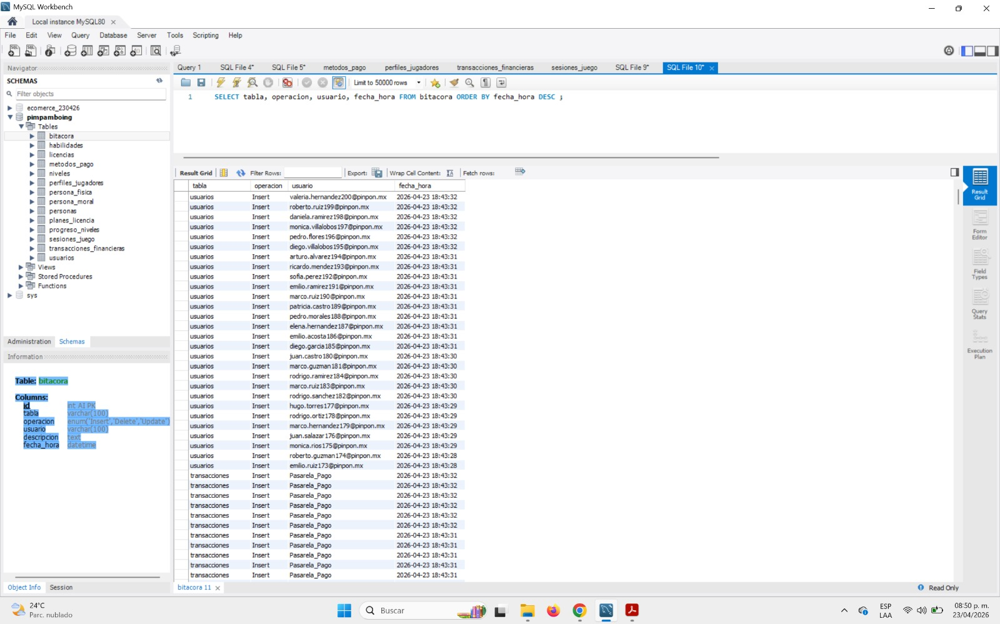

#### **TEST 02 - Auditoría de Operaciones (Bitácora)**

**Nombre:** Monitoreo de Transacciones y Registros Recientes

**Descripción:** Listado de los últimos movimientos realizados en la base de datos, ordenados cronológicamente.

**Objetivo:** Validar que los triggers o procesos de auditoría estén registrando correctamente los Insert, Update o Delete realizados por los usuarios o el sistema.

**Criterios de Aprobación:** Se deben visualizar las tablas afectadas, el tipo de operación y la marca de tiempo exacta.

**Estatus:** Exitoso

**Código SQL:**

SQL

SELECT tabla, operacion, usuario, fecha\_hora 

FROM bitacora 

ORDER BY fecha\_hora DESC;

**Evidencias:**

