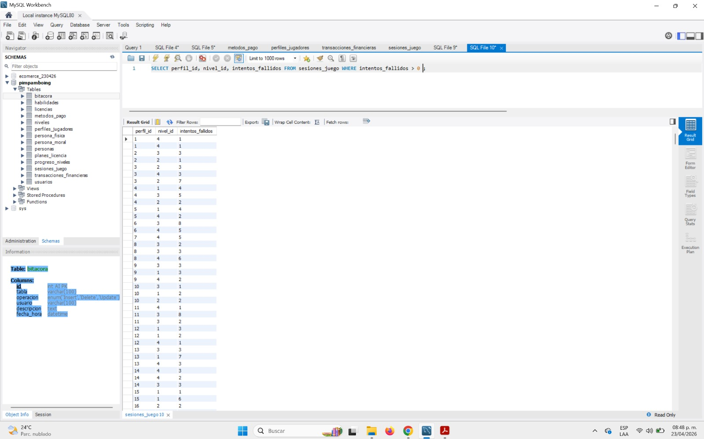

##### **TEST 03 - Análisis de Rendimiento de Juego (Dificultad)**

**Nombre:** Reporte de Intentos Fallidos por Nivel

**Descripción:** Filtra las sesiones de juego donde los usuarios han tenido dificultades para completar un nivel.

**Objetivo:** Identificar niveles con una tasa de error alta para balancear la dificultad del juego.

**Criterios de Aprobación:** Los resultados deben mostrar solo registros donde intentos\_fallidos sea mayor a cero.

**Estatus:** Exitoso

**Código SQL:**

SQL

SELECT perfil\_id, nivel\_id, intentos\_fallidos 

FROM sesiones\_juego 

WHERE intentos\_fallidos > 0;

**Evidencias:**

