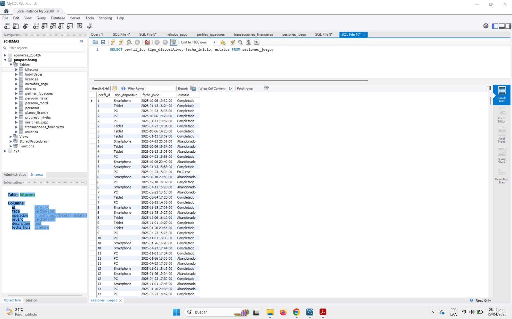

#### **TEST 05 - Validación de Dispositivos y Sesiones**

**Nombre:** Control de Acceso por Tipo de Dispositivo

**Descripción:** Listado de sesiones activas, abandonadas o completadas detallando el hardware utilizado.

**Objetivo:** Verificar la compatibilidad del juego y el comportamiento del usuario según el dispositivo (Smartphone, Tablet, PC).

**Criterios de Aprobación:** Cada sesión debe tener asignado un tipo\_dispositivo y un estatus válido.

**Estatus:** Exitoso

**Código SQL:**

SQL

SELECT perfil\_id, tipo\_dispositivo, fecha\_inicio, estatus 

FROM sesiones\_juego;

**Evidencias:**

